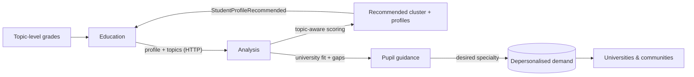
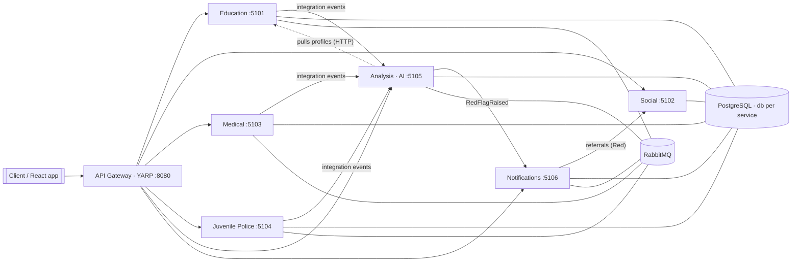

# Child Rights Monitoring Dashboard

A management dashboard backend for monitoring **child rights**, with a focus on the
**2027 Ukrainian profile-education reform**. It aggregates data from multiple government
agencies — **education, social services, medical and juvenile police** — and turns it into
tiered **red flags**, **topic-aware profile recommendations**, **university-fit guidance**,
and coordinated **cross-agency actions**.

Built as a **.NET 10** REST API platform of **microservices** (one per agency) with
clean architecture, an AI-ready analysis engine, PostgreSQL, RabbitMQ messaging,
Swagger on every service, and a one-command Docker demo.

> Status: backend reference implementation. The frontend is intentionally out of scope
> (a separate team / AI design tool will build a React app against these APIs).

---

## Table of contents

- [What it does](#what-it-does)
- [Profile-education reform model](#profile-education-reform-model)
- [Architecture at a glance](#architecture-at-a-glance)
- [Tech stack](#tech-stack)
- [Quick start (Docker — recommended)](#quick-start-docker--recommended)
- [Quick start (local .NET)](#quick-start-local-net)
- [End-to-end demo](#end-to-end-demo)
- [Services & ports](#services--ports)
- [Red-flag & recommendation model](#red-flag--recommendation-model)
- [AI & analysis](#ai--analysis)
- [Project structure](#project-structure)
- [Documentation](#documentation)

---

## What it does

- **Ingests** data from agency microservices (attendance, **topic-level grades**, medical
  visits, bullying reports).
- **Analyses** it at multiple levels — pupil, class, school, community, region, country.
- **Recommends specialisation profiles** for the 2027 reform: a topic-aware engine scores
  the pupil against the **direction → cluster → profile** hierarchy and recommends a
  cluster and the best-fitting profiles within it. It compares the pupil's **desired**
  profiles against the **recommended** ones and flags a mismatch.
- **Guides university choice** — ranks university specialties by how well a pupil fits them
  and tells the pupil exactly **which subjects/topics to improve** (and by how much) for a
  chosen specialty.
- **Sends depersonalised demand to universities & communities** — aggregated interest and
  data-driven candidate counts per specialty, never exposing an individual pupil.
- **Raises tiered red flags** (🟡 Yellow → 🟠 Orange → 🔴 Red), each with the audiences to
  inform and recommended actions.
- **Coordinates agencies** — Red-severity flags automatically generate inter-agency
  referrals (e.g. excessive absences → social services / juvenile police).

### Example red flags

| Signal                                   | Severity | Who is informed / action                           |
| ---------------------------------------- | -------- | -------------------------------------------------- |
| 10 unexcused absences                    | 🟠 Orange | parents + administration                           |
| 20 unexcused absences                    | 🔴 Red    | escalate to social services & juvenile police      |
| Subject grades fall below threshold      | 🟡 Yellow | class teacher + parents                            |
| Desired profile ≠ recommended cluster    | 🟡 Yellow | profile-orientation consultation (pupil + parent)  |
| Recurring illness (medical category)     | 🟠 Orange | refer to a specialist (medical)                    |
| Bullying report in a pupil's class       | 🔴 Red    | whole-class risk → juvenile police + safety officer |

---

## Profile-education reform model

The reform's structure is modelled as a three-level hierarchy in the shared kernel and is
served to clients via `GET /api/reference/reform` (Education):

```
Direction (Academic | Professional)
   └─ Cluster (a pupil enrols in one cluster…)
        └─ Profile (…and may choose SEVERAL profiles within it)
```

- **12 profiles** — 2 academic clusters (Природничо-математичний / STEM, Суспільно-гуманітарний)
  plus 10 professional directions (Аграрний, Будівельний, Транспортно-логістичний,
  Інженерно-технологічний, Медичний, ІТ, Бізнес та адміністрування, Освітньо-гуманітарний,
  Гостинність та організація подій, Послуги краси та дизайн).
- **Institution types** decide which profiles an institution may offer: academic lyceums
  offer academic clusters; professional lyceums and фахові коледжі offer professional ones;
  gymnasiums are the basic-secondary feeders. (`InstitutionType` + `InstitutionTaxonomy`.)
- **Topic-aware scoring** — grades carry a **topic** (e.g. "Фінансове право" inside
  Правознавство). Topics are weighted higher than whole-subject averages and cluster scores
  use evidence-weighted shrinkage, so a pupil strong in finance topics is steered toward the
  business cluster rather than the broad legal one.
- **Three profile links per pupil** — `DeclaredProfile` (current), `DesiredProfiles`
  (self-reported, one cluster) and `RecommendedProfiles` (written back from Analysis).

### Profile & university flow



---


## Architecture at a glance



- **Clean architecture** for the information-rich services (Education, Analysis):
  `Domain → Application → Infrastructure → Api`, dependencies pointing inwards.
- **Database-per-service**; cross-service **reads over HTTP**, **writes over events**.
- **Shared building blocks** (kernel + host defaults + integration-event contracts)
  keep every service consistent without coupling their domains.

See [docs/ARCHITECTURE.md](docs/ARCHITECTURE.md) for the full picture.

---

## Tech stack

| Concern        | Choice                                                        |
| -------------- | ------------------------------------------------------------- |
| Runtime        | .NET 10 / ASP.NET Core (REST)                                 |
| API docs       | Swagger / OpenAPI (Swashbuckle) on every service              |
| Persistence    | PostgreSQL + EF Core 10 (Npgsql), one database per service    |
| Messaging      | MassTransit over RabbitMQ (in-memory fallback)                |
| Gateway        | YARP reverse proxy                                            |
| Validation     | FluentValidation (dispatcher pipeline)                        |
| Logging        | Serilog (structured) + RFC 7807 ProblemDetails               |
| Resilience     | `Microsoft.Extensions.Http.Resilience` (retry/timeout/breaker) |
| AI             | Pluggable providers — deterministic rules + OpenAI-compatible LLM |
| Packaging      | Multi-stage Dockerfile + Docker Compose                      |

---

## Quick start (Docker — recommended)

Requirements: **Docker Desktop**.

```powershell
docker compose -f deploy/docker-compose.yml up --build
```

This starts PostgreSQL, RabbitMQ, all six services and the gateway. Then open:

- **Gateway**: http://localhost:8080
- **RabbitMQ UI**: http://localhost:15672 (guest / guest)
- Swagger for any service, e.g. **Analysis**: http://localhost:5105/swagger

To enable the LLM model, set an OpenAI key before starting:

```powershell
$env:OPENAI_API_KEY = "sk-..."
docker compose -f deploy/docker-compose.yml up --build
```

Tear down (and wipe data):

```powershell
docker compose -f deploy/docker-compose.yml down -v
```

---

## Quick start (local .NET)

Requirements: **.NET 10 SDK**, a local **PostgreSQL** on `localhost:5432`
(`postgres` / `postgres`). RabbitMQ is optional (without it, services use an in-memory
bus and cross-service messaging is limited to a single process — use Docker for the
full flow).

```powershell
dotnet build ChildRights.slnx

# launches every service + gateway in separate windows
./scripts/run-local.ps1
```

Databases and demo data are created automatically on first run.

---

## End-to-end demo

With the stack running (Docker recommended so messaging works), drive the full
cross-agency scenario:

```powershell
./scripts/demo.ps1                       # against the gateway on :8080
```

The script walks through:

1. Read a pupil's Education profile.
2. Run on-demand Analysis → **attendance red flag** + **profiling recommendation**.
3. Post a 3rd recurring medical visit → **medical concern** → **medical red flag**.
4. File a bullying report → **class-level red flag**.
5. Read the **dashboard summary**.
6. See **notifications** dispatched per audience.
7. See **inter-agency referrals** auto-raised for Red flags.
8. See **social-services cases** opened from those referrals.

---

## Services & ports

| Service         | Port | Responsibility                                                |
| --------------- | ---- | ------------------------------------------------------------- |
| API Gateway     | 8080 | Single entry point (YARP), routes to all services             |
| Education       | 5101 | Pupils, classes, **institutions & offered profiles**, attendance, **topic grades**, desired profiles; emits education events |
| Social Services | 5102 | Social cases; consumes inter-agency referrals                 |
| Medical         | 5103 | Medical visits; emits recurring-concern events                |
| Juvenile Police | 5104 | Bullying reports; emits class-level signals                   |
| Analysis (AI)   | 5105 | Topic-aware profiling, red flags, **university fit/gap & demand**, runs, dashboard |
| Notifications   | 5106 | Fan-out to audiences; raises inter-agency referrals           |

Full endpoint list: [docs/API.md](docs/API.md).

---

## Red-flag & recommendation model

- **Severity is tiered** (`Green / Yellow / Orange / Red`) so escalation differs by level
  — Yellow stays inside the school, Orange notifies parents/administration, Red triggers
  cross-agency referrals.
- **Scopes**: `Student / Class / School / Community / Region / Country`.
- **Audiences**: pupil, parent, teacher, class teacher, school administration,
  education-safety officer, social service, juvenile police, medical service, community
  and regional authorities.
- **Profile recommendations**: recommended **cluster + profiles** (topic-aware), profile
  change when the desired cluster differs from the data-driven one, open/close a school
  profile, create an academy course for a community/region.
- **University guidance**: ranked specialty fit with concrete subject/topic improvement
  gaps, and depersonalised per-specialty demand for universities.

The rules are pure, unit-testable domain logic in
`src/Services/Analysis/ChildRights.Analysis.Domain` (`StudentRiskRules`,
`ProfileScoringMap`, `UniversityFitCalculator`).

---

## AI & analysis

The Analysis service is **AI-ready by design** — "the model" is a swappable strategy:

- `rule-based-v1` — deterministic engine over the domain rules. Always on; the default
  and the fallback.
- `gpt-4o-mini` (OpenAI-compatible) — enabled only when an API key is configured.

Best practices built in: **pluggable models** (choose per request), **data minimisation**
(no personal identifiers in prompts), a **strict JSON response contract**, **resilient**
outbound calls, **graceful degradation** to rules on failure, and **auditable** runs.

Analysis runs in three modes: **event-triggered**, **scheduled** (configurable sweep),
and **on-demand**. See [docs/ARCHITECTURE.md §6](docs/ARCHITECTURE.md#6-ai-strategy--best-practices).

---

## Project structure

```
src/
├─ BuildingBlocks/          # Domain kernel, Application (CQRS), Infrastructure, Contracts
├─ ApiGateway/              # YARP reverse proxy
└─ Services/
   ├─ Education/            # Domain · Application · Infrastructure · Api  (clean architecture)
   ├─ Analysis/             # Domain · Application · Infrastructure · Api  (clean architecture)
   ├─ Social/               # single Web API project
   ├─ Medical/              # single Web API project
   ├─ JuvenilePolice/       # single Web API project
   └─ Notifications/        # single Web API project
deploy/                     # Dockerfile + docker-compose.yml
scripts/                    # run-local.ps1, demo.ps1
docs/                       # ARCHITECTURE.md, API.md
```

---

## Documentation

- [docs/ARCHITECTURE.md](docs/ARCHITECTURE.md) — architecture, layers, event flow, AI strategy.
- [docs/API.md](docs/API.md) — endpoints and integration events.

---

## Notes & next steps

- For the demo, schemas are created with EF Core `EnsureCreated` and seeded on startup.
  For production, switch to **EF Core migrations** and externalise secrets.
- Authentication/authorization is not wired up yet — add JWT bearer auth at the gateway
  and per-service for a real deployment.
- The seed data is deterministic so the demo always produces the same red flags and
  recommendations.
