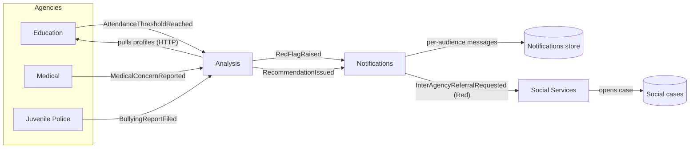

# Architecture

The Child Rights Monitoring Dashboard is a microservices platform that ingests data
from several government agencies, analyses it (with rules and/or AI), raises tiered
**red flags**, issues **profiling recommendations**, and coordinates **cross-agency
actions** — all at multiple levels of the education hierarchy (pupil → class → school
→ community → region → country).

## 1. Solution layout

```
samara-dashboard/
├─ ChildRights.slnx                 # solution (new .slnx format, .NET 10)
├─ global.json                      # pins the .NET 10 SDK
├─ Directory.Build.props            # shared build settings (net10.0, nullable, …)
├─ Directory.Packages.props         # central NuGet package versions
├─ deploy/                          # Dockerfile + docker-compose for the demo
├─ scripts/                         # run-local.ps1, demo.ps1
├─ docs/                            # this folder
└─ src/
   ├─ BuildingBlocks/               # shared kernel + cross-cutting infrastructure
   │  ├─ ChildRights.BuildingBlocks.Domain
   │  ├─ ChildRights.BuildingBlocks.Application
   │  ├─ ChildRights.BuildingBlocks.Infrastructure
   │  └─ ChildRights.Contracts      # integration events (public service contracts)
   ├─ ApiGateway/
   │  └─ ChildRights.ApiGateway     # YARP reverse proxy (single entry point)
   └─ Services/
      ├─ Education/                 # 4-layer clean architecture (reference service)
      ├─ Analysis/                  # 4-layer clean architecture (AI "brain")
      ├─ Social/                    # agency service (single Web API project)
      ├─ Medical/                   # agency service
      ├─ JuvenilePolice/            # agency service
      └─ Notifications/             # fan-out + inter-agency referrals
```

## 2. Per-service clean architecture

The two information-rich services (**Education**, **Analysis**) use a four-project
clean/onion architecture. Dependencies always point **inwards**:

```
Api  ─►  Infrastructure  ─►  Application  ─►  Domain
                 └──────────────►──────────────┘
```

| Layer            | Responsibility                                                            | Depends on            |
| ---------------- | ------------------------------------------------------------------------- | --------------------- |
| `Domain`         | Entities, value objects, enums, **pure business rules/policies**          | BuildingBlocks.Domain |
| `Application`    | CQRS commands/queries + handlers, DTOs, ports (interfaces)                | Domain                |
| `Infrastructure` | EF Core, message bus, HTTP clients, AI providers, schedulers              | Application           |
| `Api`            | Thin controllers, request models, composition root                        | Infrastructure        |

The four agency/notification services are intentionally lighter — a single Web API
project with internal `Domain` / `Persistence` / `Controllers` / `Messaging` folders —
because their job is mostly to record events and publish/consume integration messages.

## 3. Building blocks (shared kernel)

- **Domain** — `Entity`, `AggregateRoot`, `ValueObject`, `Result`/`Error` (the Result
  pattern), and the cross-service enums: `Agency`, `FlagSeverity` (Green/Yellow/Orange/Red),
  `AnalysisScope`, `AudienceRole`, `AnalysisTrigger`.
- **Application** — a tiny in-house CQRS mediator (`IDispatcher`) with a FluentValidation
  pipeline, plus ports (`IEventPublisher`, `IUnitOfWork`, `IClock`, `IDataSeeder`).
  No third-party mediator dependency.
- **Infrastructure** — one-line host setup (`AddServiceDefaults`/`UseServiceDefaults`):
  Serilog, RFC 7807 ProblemDetails, health checks, Swagger; the message bus
  (`AddEventBus`, MassTransit over RabbitMQ with an in-memory fallback); EF Core
  PostgreSQL registration; and a shared `ApiControllerBase` that maps `Result` → HTTP.
- **Contracts** — the versioned integration events exchanged between services.

## 4. Red-flag model (tiered)

Severity is a **traffic-light tier**, not a binary, so escalation policy differs per level:

| Severity | Meaning            | Typical action                                          |
| -------- | ------------------ | ------------------------------------------------------- |
| Green    | no concern         | none                                                    |
| Yellow   | advisory           | handled inside the school (class teacher)               |
| Orange   | elevated           | notify parents + administration                         |
| Red      | urgent             | **cross-agency referral** (social services / police / medical) |

Example rules implemented in `Analysis.Domain` (`StudentRiskRules`):

- **Attendance** — 5 → Yellow, 10 → Orange (parents/admin), 20 → Red (escalate).
- **Academic risk** — any subject average below 4/12.
- **Profile mismatch** — the pupil's desired cluster differs from the data-driven one.
- **Medical** (from the Medical service) — recurring condition category.
- **Bullying** (from Juvenile Police) — class-level signal, risk to the whole class.

## 5. Profile-education reform (the platform focus)

The 2027 reform is modelled in the shared kernel as a **direction → cluster → profile**
hierarchy (`EducationProfile`, `ProfileCluster`, `EducationDirection`, `InstitutionType`
with `ProfileTaxonomy` / `InstitutionTaxonomy`). A pupil enrols in one **cluster** and may
choose **several profiles** within it.

Topic-aware profiling (`ProfileScoringMap`, `StudentRiskRules`):

- Grades carry a **topic**; `ScoreProfiles` weights topics above whole-subject averages.
- `ScoreClusters` aggregates evidence per cluster with **Bayesian shrinkage**, so a single
  thin signal can't outrank a well-evidenced cluster.
- The engine recommends a **cluster + the strongest profiles** in it, compares it with the
  pupil's **desired** cluster, and writes the result back to Education via
  `StudentProfileRecommendedIntegrationEvent` (establishing the pupil↔recommended link).

Recommendation scopes:

- **Pupil** — recommended cluster/profiles; profile-change when desired ≠ recommended.
- **School** — which profiles to open/close based on aggregated demand.
- **Community / region** — which courses to create for continuing-education academies.

## 5a. University fit, gaps & demand

`UniversityFitCalculator` (pure domain) matches a pupil's subject/topic grades against a
university programme's key areas:

- **Fit** — a 0–1 score and whether the pupil meets the competitive threshold.
- **Gaps** — concrete, topic-level guidance ("raise Фінансове право from 7 to 9").
- **Interest** — a pupil can express interest in a specialty (`ProgramInterest`).
- **Depersonalised demand** — per-specialty counts (explicit interest + data-driven
  candidates from `StudentProfileInsight`) for universities and communities; no individual
  pupil is ever exposed.


## 6. AI strategy & best practices

The Analysis service treats "the model" as a swappable strategy
(`IAiAnalysisProvider` + `IAiAnalysisProviderFactory`):

- `rule-based-v1` — a deterministic engine wrapping the pure domain rules. Always
  available; the safe default and fallback.
- `gpt-4o-mini` (OpenAI-compatible) — registered **only** when an API key is configured.

Baked-in practices:

- **Pluggable models** — choose per request (`?model=`), no code change to swap.
- **Goal-focused prompting** — each analysis goal has its **own** instruction, not one
  catch-all prompt (see below).
- **Data minimisation** — no personal identifiers are sent to the LLM prompt, and each goal
  sees only the facts it needs (e.g. only the admission goals receive НМТ scores).
- **Strict output contract** — the model must return JSON, parsed defensively.
- **Resilience** — outbound HTTP uses the standard retry/timeout/circuit-breaker handler.
- **Graceful degradation** — any LLM failure falls back to the deterministic engine for the
  *same* goal.
- **Auditability** — every run is persisted (`AnalysisRun`) with its trigger and model.

### Per-goal analysis (`AnalysisGoal`)

Red flags are looked for **per concrete case**. The platform splits analysis into four
focused goals, each with its own system prompt, its own user prompt (only the relevant
inputs), its own red flags and its own JSON contract — so each can later become its own
model without touching callers:

| Goal               | Stage   | Concern                                            |
| ------------------ | ------- | -------------------------------------------------- |
| `StudentRisk`      | all     | attendance + academic red flags                    |
| `ProfileChoice`    | ≤ 10    | which specialisation profile/cluster to choose     |
| `NmtFourthSubject` | 11+     | which 4th НМТ subject to take                       |
| `AdmissionDirection` | 11+   | which admission direction (фах) to enter           |

The coarse `?kind=Profile|Admission|All` knob expands to the matching set of goals
(`Profile` → risk + profile choice; `Admission` → risk + both admission goals). Both the
rule engine and the LLM provider route every goal independently, so the deterministic
fallback always matches the goal that failed.

### Three execution modes

| Trigger     | How                                                                  |
| ----------- | ------------------------------------------------------------------- |
| `Event`     | a consumer reacts to an integration event (e.g. attendance threshold) |
| `Scheduled` | `ScheduledAnalysisService` background sweep (`Ai:ScheduleMinutes`)   |
| `OnDemand`  | an explicit API call                                                 |

## 7. Cross-agency event flow



1. An agency records something and **publishes an integration event**.
2. **Analysis** consumes it, runs the selected model, persists flags/recommendations,
   and publishes `RedFlagRaised` / `RecommendationIssued`.
3. **Notifications** fans each red flag out to its target audiences and, for **Red**
   severity, raises `InterAgencyReferralRequested`.
4. **Social Services** consumes referrals addressed to it and opens a case — closing
   the loop end to end.

## 8. Data & messaging

- **Database**: PostgreSQL, **one logical database per service** (database-per-service
  pattern). Each service owns its schema (`education`, `analysis`, `social`, …) and never
  reaches into another service's tables — cross-service reads happen over HTTP, writes
  over events. For the demo the schema is created with `EnsureCreated` and seeded on
  startup; production should switch to EF Core migrations.
- **Messaging**: MassTransit. With `MessageBus:Host` set it uses RabbitMQ; otherwise it
  falls back to an in-memory transport so a single service still runs without a broker.

## 9. API gateway

`ChildRights.ApiGateway` (YARP) is the single entry point on port **8080**. It routes
`/education/**`, `/social/**`, `/medical/**`, `/juvenile/**`, `/analysis/**` and
`/notifications/**` to the corresponding service, stripping the path prefix.
